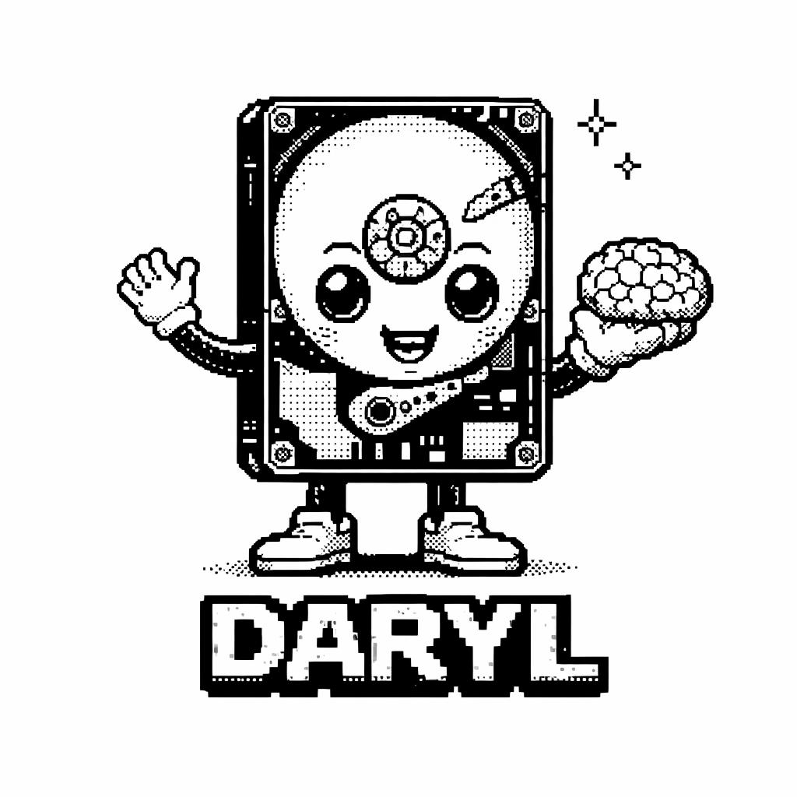

<p align="center">
  
</p>

<h1 align="center">Daryl</h1>

<p align="center">
<strong>Provable memory for AI agents</strong>
</p>

<p align="center">
Created by <strong>Mohamed Azizi</strong> · <a href="https://www.daryl.md">daryl.md</a>
</p>

<p align="center">


</p>

---

AI agents forget everything between sessions.
When they don't, you can't verify what they remember.

**DSM (Daryl Sharding Memory)** gives agents a memory they can prove — an append-only event log where every entry is hash-chained, every session is replayable, and every claim is verifiable with one command.

## What agents get

- **Total recall** — every action, snapshot, and decision is logged as an immutable entry. Nothing is lost, nothing is overwritten.
- **Tamper-proof history** — each entry carries a SHA-256 hash chained to the previous one. Alter one byte, the chain breaks.
- **One-command verification** — `dsm verify --shard sessions` checks the entire history in milliseconds.
- **Structured sessions** — start, act, observe, end. The agent's lifecycle is a first-class concept, not an afterthought.

## 10 seconds to memory

```python
from dsm.core.storage import Storage
from dsm.session.session_graph import SessionGraph
from dsm.session.session_limits_manager import SessionLimitsManager

storage = Storage(data_dir="memory")
limits = SessionLimitsManager.agent_defaults("memory")
session = SessionGraph(storage=storage, limits_manager=limits)

session.start_session(source="my_agent")
session.execute_action("search", {"query": "weather in paris"})
session.execute_action("reply", {"text": "It's sunny in Paris"})
session.end_session()
```

4 events written. Hash-chained. Replayable. Done.

## Verify everything

```
$ dsm verify --shard sessions

shard_id: sessions
total_entries: 4
verified: 4
tampered: 0
chain_breaks: 0
status: OK
```

If anyone — or anything — modifies the history, DSM catches it.

## How it compares

| What you need | Logs | Vector DB | DSM |
|---|:---:|:---:|:---:|
| Replay exact agent history | ❌ | ❌ | ✅ |
| Prove nothing was altered | ❌ | ❌ | ✅ |
| Audit agent behavior | ❌ | ❌ | ✅ |
| Detect hallucinated memories | ❌ | ❌ | ✅ |
| Semantic search | ❌ | ✅ | ❌ |

DSM doesn't replace a vector database. It complements it — **the vector DB searches, DSM proves.**

## Agents that can't lie about what they did

When an agent says *"I searched the web and found X"*, how do you know it actually did?

With DSM, you don't trust — you verify. Every action the agent claims to have taken is either in the hash-chained log or it isn't. There is no middle ground.

```python
# Agent says it searched for weather — did it?
entries = storage.read("sessions", limit=20)
actions = [e for e in entries if e.metadata.get("action_name") == "search"]
# Either the search entry exists with its exact payload, or the agent is hallucinating.
```

This doesn't prevent an LLM from hallucinating. It makes hallucinations about past behavior **detectable and provable** — the agent's memory is a chain of cryptographic facts, not a probabilistic reconstruction.

### Self-aware agents

An agent with DSM can detect **its own** hallucinations before responding:

```python
# Agent "remembers" searching for weather yesterday.
# Instead of trusting its context window, it checks:

entries = storage.read("sessions", limit=100)
searches = [e for e in entries if e.metadata.get("action_name") == "search"]

if searches:
    # Memory confirmed — respond with confidence
    last_search = searches[0]
else:
    # No search in the log. The "memory" is a hallucination.
    # Agent corrects itself before the user ever sees the mistake.
```

The agent's context window is lossy and probabilistic. DSM is neither. When the two disagree, DSM is right.

## Architecture

```
Your Agent
    ↓
SessionGraph          ← lifecycle: start, snapshot, action, end
    ↓
RR (Read Relay)       ← query: recent entries, summaries, filters
    ↓
DSM Core              ← storage: append-only, hash-chained, frozen
```

The kernel (`src/dsm/core/`) is **frozen since March 2026** — battle-tested, minimal modifications (K-1/K-2/K-3 crash safety, W-7 portable locking). Everything above it (P3–P11: SDK facade, pre-commitment, shard sealing, cross-agent receipts, session index, policy adapters, Ed25519 signing, artifact store, causal ordering, compute attestation) uses the public API without touching the internals. Security audit fixes (S-1 through S-5) harden encryption, key management, and startup verification.

For the full architecture: [ARCHITECTURE.md](ARCHITECTURE.md)

## Install

```bash
git clone https://github.com/daryl-labs-ai/daryl
cd daryl
pip install -e .
```

## Run the tests

```bash
pip install -e .[dev]
python -m pytest tests/ -v   # 376 tests, 0 failures
```

## Read agent memory

```python
from dsm.core.storage import Storage
from dsm.rr.relay import DSMReadRelay

storage = Storage(data_dir="memory")
relay = DSMReadRelay(storage=storage)

# Last 10 events
recent = relay.read_recent("sessions", limit=10)

# Session summary with top actions
summary = relay.summary("sessions")
# → {'entry_count': 15, 'unique_sessions': 4, 'top_actions': [('search', 3), ('reply', 2)]}
```

## Verify integrity

```python
from dsm.verify import verify_shard, verify_all

# Verify one shard
result = verify_shard(storage, "sessions")
assert result["status"] == "OK"

# Verify everything
results = verify_all(storage)
```

## Repository structure

```
src/dsm/
  core/         # frozen kernel — storage, models, hash chain, segments
  session/      # SessionGraph lifecycle management
  rr/           # Read Relay — query layer over storage
  ans/          # Analytics — skill performance, workflow insights
  skills/       # Skill registry, router, ingestor
  agent.py      # DarylAgent — SDK facade (P3)
  anchor.py     # Pre-commitment & environment anchoring (P4)
  seal.py       # Shard sealing for selective forgetting (P5)
  exchange.py   # Cross-agent trust receipts (P6)
  signing.py    # Ed25519 entry signing (P9)
  artifacts.py  # Content-addressable artifact store (P9)
  causal.py     # Cross-agent causal binding (P10)
  attestation.py # Compute attestation — input-output binding (P11)
  status.py     # Status enums (VerifyStatus, ReceiptStatus, etc.)

tests/          # 376 tests — core, session, rr, ans, P3-P11, security, integration
docs/           # Architecture, known issues, roadmap
```

## Known limitations

DSM is an **event log**, not a database.

- **No semantic search** — it stores and verifies, it doesn't understand. Use a vector DB alongside it for retrieval.
- **Single writer per shard** — concurrent writes are serialized per shard via lockfile (fixed in v0.7.0, see [K-1](docs/KNOWN_ISSUES.md)). Multi-process writes to the same shard are safe; multi-shard parallelism is native.
- **Cross-platform** — v0.7.0 uses `filelock` for portable locking (Linux, macOS, Windows).

These are architectural choices, not bugs. DSM does one thing — provable, replayable agent memory — and does it correctly.

## Contributing

```bash
git clone https://github.com/daryl-labs-ai/daryl && cd daryl
pip install -e .[dev]
python -m pytest tests/
```

The kernel (`src/dsm/core/`) is frozen. Do not modify it without opening a design discussion.

See [CONTRIBUTING.md](CONTRIBUTING.md) for guidelines.

## License

MIT — see [LICENSE](LICENSE).
