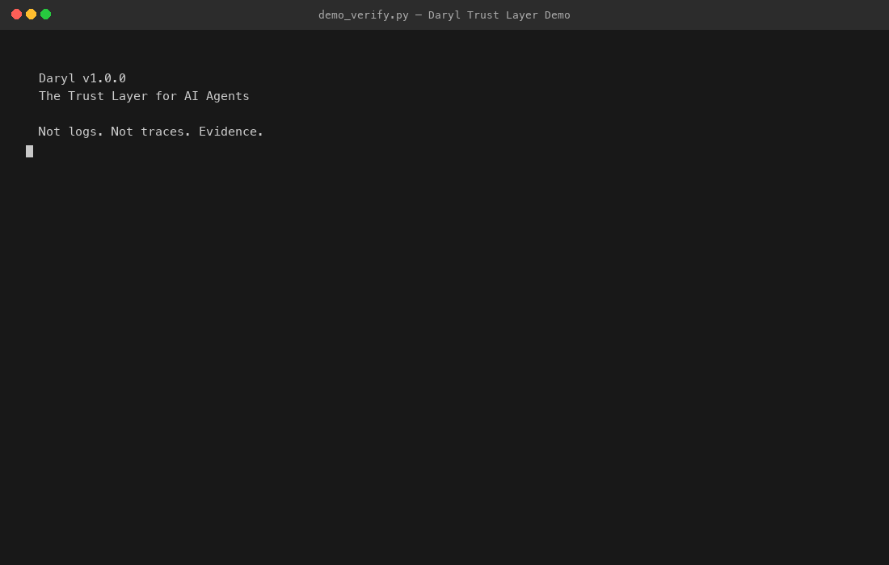

<p align="center">
  
</p>

<h1 align="center">Daryl</h1>

<p align="center">
<strong>DSM (Daryl Sharding Memory) — The trust layer for AI agents.</strong>
</p>

<p align="center">
<em>Cryptographic proof of every decision an agent makes.</em><br>
<em>Not logs. Not traces. Evidence.</em>
</p>

<p align="center">
Created by <strong>Mohamed Azizi</strong> · <a href="https://www.daryl.md">daryl.md</a>
</p>

<p align="center">


</p>

---

## The Problem

You deployed an AI agent. It made a decision. Something went wrong.

Now prove what happened.

Logs tell you *that* something ran. Observability dashboards tell you *how long* it took. Neither can answer the question that matters: **did the agent actually do what it claims it did, and can you prove it hasn't been altered after the fact?**

- Logs are mutable. Anyone with access can edit or delete them.
- Vector databases reconstruct context probabilistically — they don't preserve decisions.
- Agent frameworks track tool calls, not verifiable proof of execution.

When a regulator, an auditor, or your own CTO asks *"prove this agent did X and not Y"*, none of these tools can answer. You need a **notary**, not a logger.

## The Solution

**DSM (Daryl Sharding Memory)** is a trust layer that gives AI agents a cryptographically verifiable execution trail. DSM turns agent execution into cryptographic evidence.

Every action, every decision, every input-output pair is recorded as an immutable, hash-chained entry. Each entry carries a SHA-256 hash linked to the previous one. Alter one byte anywhere in the chain, and verification fails. One command checks the entire history.

DSM does not replace your logs or your vector database. It sits alongside them as the **proof layer** — the part you hand to an auditor.

## How It Works

```
1. Agent acts                      →  action intent is appended to an append-only shard
2. Entry is hashed                 →  SHA-256(content + prev_hash) — chained to all prior entries
3. Entry is signed                 →  Ed25519 signature proves authorship (optional)
4. Chain is sealed                 →  shard can be archived with a cryptographic tombstone
5. Anyone can verify independently →  replay the chain, recompute every hash, confirm integrity
```

**Append-only**: entries are never modified or deleted. New entries extend the chain.
**Hash-chained**: each entry's hash depends on the previous entry. Tampering breaks the chain.
**Attestation**: input-output bindings prove which output was produced for which input.
**Replay**: the full agent history can be deterministically replayed and verified.

## How It Compares

| Capability | Logs | Vector DB | Agent Frameworks | **Daryl (DSM)** |
|---|:---:|:---:|:---:|:---:|
| Prove nothing was altered | - | - | - | **SHA-256 hash chain** |
| Prove agent authorship | - | - | - | **Ed25519 signatures** |
| Prove input→output binding | - | - | - | **Compute attestation** |
| Replay exact execution history | - | - | Partial | **Full deterministic replay** |
| Cross-agent causal proof | - | - | - | **Dispatch + routing hashes** |
| Compliance-ready audit trail | - | - | - | **Seal + archive** |
| Semantic search | - | Yes | - | - |
| Real-time dashboards | Yes | - | Yes | - |

DSM is not a replacement for observability. It is the layer that makes your agent's history **admissible as evidence**.

## Architecture

Daryl is structured in three layers: execution, trust, and governance.

```
Your Agent(s)
    ↓
SessionGraph              ← lifecycle: start, act, confirm, end
    ↓
┌──────────────────────────────────────────────────────┐
│  Trust Modules                                       │
│  · Ed25519 Signing     — prove authorship            │
│  · Compute Attestation — bind input to output        │
│  · Causal Binding      — prove cross-agent causality │
│  · Trust Receipts      — portable proof of work      │
│  · Shard Sealing       — archive with crypto proof   │
└──────────────────────────────────────────────────────┘
    ↓
┌──────────────────────────────────────────────────────┐
│  Governance (A→E Pillars)                            │
│  A IdentityRegistry    — multi-agent identity        │
│  B SovereigntyPolicy   — human access control        │
│  C NeutralOrchestrator — rule-based admission        │
│  D CollectiveShard     — shared verifiable state     │
│  E ShardLifecycle      — drain / seal / archive      │
└──────────────────────────────────────────────────────┘
    ↓
DSM Core (frozen since March 2026)
    ← append-only storage, hash chain, segments
```

## Quick Start

### Install

```bash
pip install daryl-dsm
```

```bash
# From source
git clone https://github.com/daryl-labs-ai/daryl
cd daryl
pip install -e .
```

### Record and verify agent actions

```python
from dsm.core.storage import Storage
from dsm.session.session_graph import SessionGraph
from dsm.session.session_limits_manager import SessionLimitsManager

# Initialize
storage = Storage(data_dir="agent_trail")
limits = SessionLimitsManager.agent_defaults("agent_trail")
session = SessionGraph(storage=storage, limits_manager=limits)

# Record agent actions — each one becomes a hash-chained entry
session.start_session(source="my_agent")
session.execute_action("search", {"query": "weather in paris"})
session.execute_action("reply", {"text": "It's sunny in Paris"})
session.end_session()
```

### Verify the entire trail

```python
from dsm.verify import verify_shard

result = verify_shard(storage, "sessions")
assert result["status"] == "OK"
# → total_entries: 4, verified: 4, tampered: 0, chain_breaks: 0
```

```bash
$ dsm verify --shard sessions

shard_id: sessions
total_entries: 4
verified: 4
tampered: 0
chain_breaks: 0
status: OK
```

If anyone — or anything — modifies the trail after the fact, verification fails.

👉 See [`demo/README.md`](demo/README.md) — tamper detection, multi-agent verification, security insight.

## 🧪 Demo

```bash
python demo_verify.py
```

Records a high-value agent decision trail, simulates a post-hoc modification, and shows how Daryl detects it.



## Core Guarantees

- **Frozen kernel** — the core storage engine (`src/dsm/core/`) has been frozen since March 2026. Zero modifications since. Everything above it uses the public API.
- **Crash-safe writes** — the WAL (write-ahead log) pattern ensures that if a process crashes between `execute_action` and `confirm_action`, the incomplete intent is detectable on replay. No silent data loss.
- **Deterministic verification** — `verify_shard` recomputes every hash from raw data in chronological order. The result is binary: the chain is intact, or it isn't.

## Advanced Capabilities

### Cross-Agent Trust Receipts

*Module: `dsm.exchange`*

When Agent B completes work for Agent A, it issues a **TaskReceipt** — a portable, self-contained proof of work. The receipt includes the entry hash, shard tip hash, and entry count at the time of issuance. A third party can verify the receipt against Agent B's shard without trusting either agent.

```python
from dsm.exchange import issue_receipt, verify_receipt, verify_receipt_against_storage

receipt = issue_receipt(storage, agent_id="agent_b", entry_id="...",
                        shard_id="sessions", task_description="Translated document")

result = verify_receipt(receipt)
# → {"status": "INTACT", "issuer": "agent_b", ...}

result = verify_receipt_against_storage(storage, receipt)
# → {"status": "CONFIRMED", "entry_found": True, "hash_matches": True}
```

### Ed25519 Entry Signing

*Module: `dsm.signing`*

Every entry or receipt can be signed with an Ed25519 keypair. This proves authorship: only the agent holding the private key could have produced a valid signature. Supports key rotation, key revocation, and hash-chained key history.

```python
from dsm.signing import AgentSigning

signer = AgentSigning(keys_dir="keys", agent_id="agent_a")
signer.generate_keypair()

signature = signer.sign_entry(entry_hash="abc123...")

result = signer.verify_signature(data_hash="abc123...",
                                  signature=signature,
                                  public_key=signer.get_public_key())
# → {"valid": True, ...}
```

### Cross-Agent Causal Binding

*Module: `dsm.causal`*

Proves that Agent B's work was in response to Agent A's specific dispatch — not a coincidence, not a replay. The dispatch hash binds A's entry, task parameters, and timestamp into a single verifiable token.

```python
from dsm.causal import create_dispatch_hash, DispatchRecord, verify_dispatch_hash

dispatch_hash = create_dispatch_hash(
    dispatcher_entry_hash="abc123...",
    task_params={"action": "translate", "lang": "fr"},
)

record = DispatchRecord(
    dispatch_hash=dispatch_hash,
    dispatcher_agent_id="agent_a",
    dispatcher_entry_hash="abc123...",
    target_agent_id="agent_b",
    task_params={"action": "translate", "lang": "fr"},
    timestamp="2026-04-12T10:00:00Z",
)

result = verify_dispatch_hash(record)
# → {"status": "VALID", ...}
```

### Compute Attestation

*Module: `dsm.attestation`*

Binds a specific input to a specific output for a given model. The attestation hash proves that *this agent* claims *this output* was produced from *this input* using *this model*. Does not prove the computation was correct (that requires TEEs) — but it makes the claim verifiable and signed.

```python
from dsm.attestation import create_attestation, verify_attestation, sign_attestation

attestation = create_attestation(
    agent_id="agent_a",
    raw_input="What is the capital of France?",
    raw_output="Paris",
    model_id="claude-sonnet-4-20250514",
)

result = verify_attestation(attestation)
# → {"status": "VALID", ...}

signed = sign_attestation(attestation, signer)
```

### Shard Sealing

*Module: `dsm.seal`*

When a shard is complete — a session is over, a compliance window has closed — it can be **sealed**. Sealing computes a cryptographic tombstone over the entire shard, optionally archives the data, and records the seal in a registry. The shard data can then be deleted; the seal proves the history existed and what it contained.

```python
from dsm.seal import seal_shard, SealRegistry, verify_seal

registry = SealRegistry(seal_dir="seals")

record = seal_shard(storage, "old_sessions", registry, archive_path="archive/")

result = verify_seal(registry, "old_sessions")
# → {"status": "VALID", "entry_count": 42, "sealed_at": "2026-04-12T..."}
```

## Why It Matters

**EU AI Act (2026)**: High-risk AI systems must maintain logs that allow traceability of decisions. DSM provides a hash-chained, tamper-evident audit trail that satisfies this requirement by design.

**Legal accountability**: When an agent makes a consequential decision — approving a loan, triaging a patient, executing a trade — the organization must be able to reconstruct exactly what happened. DSM makes the reconstruction verifiable, not just plausible.

**Internal governance**: For teams running multi-agent systems, DSM provides the infrastructure to answer "which agent did what, when, and was it authorized?" — with cryptographic proof, not log grep.

## Open vs Private

**This repository (open source, MIT)**:
- DSM core engine — append-only storage, hash chain, verification
- Session lifecycle — start, act, confirm, end
- All trust modules — signing, attestation, causal binding, receipts, sealing
- Multi-agent governance — identity, sovereignty, orchestration, collective, lifecycle
- Parallel shard lanes, cold storage, Read Relay query layer
- CLI tools, Goose MCP integration
- 1153 tests

**Private extensions (not in this repo)**:
- Hosted verification API
- Dashboard and compliance reporting UI
- Enterprise SSO and team management
- Managed archival and retention policies

## Vision

Daryl aims to become the standard for verifiable agent execution — the equivalent of digital signatures, but for AI decisions.

## Get in Touch

- Web: [daryl.md](https://www.daryl.md)
- GitHub: [github.com/daryl-labs-ai/daryl](https://github.com/daryl-labs-ai/daryl)

## Run the Tests

```bash
git clone https://github.com/daryl-labs-ai/daryl
cd daryl
pip install -e .[dev]
python -m pytest tests/ -v   # 1153 tests, 0 failures
```

## Contributing

```bash
git clone https://github.com/daryl-labs-ai/daryl && cd daryl
pip install -e .[dev]
python -m pytest tests/
```

The kernel (`src/dsm/core/`) is frozen. Do not modify it without opening a design discussion. See [CONTRIBUTING.md](CONTRIBUTING.md) for guidelines.

## License

MIT — see [LICENSE](LICENSE).

## Disclaimer

DSM provides cryptographic integrity verification for agent execution trails. It proves that recorded data has not been tampered with after the fact. It does **not** prove that the original data was truthful, that the computation was correct, or that the agent behaved as intended. Hash chain integrity is a necessary condition for trustworthy audit trails, not a sufficient one. For claims about computation correctness, additional infrastructure (e.g., trusted execution environments) is required.
